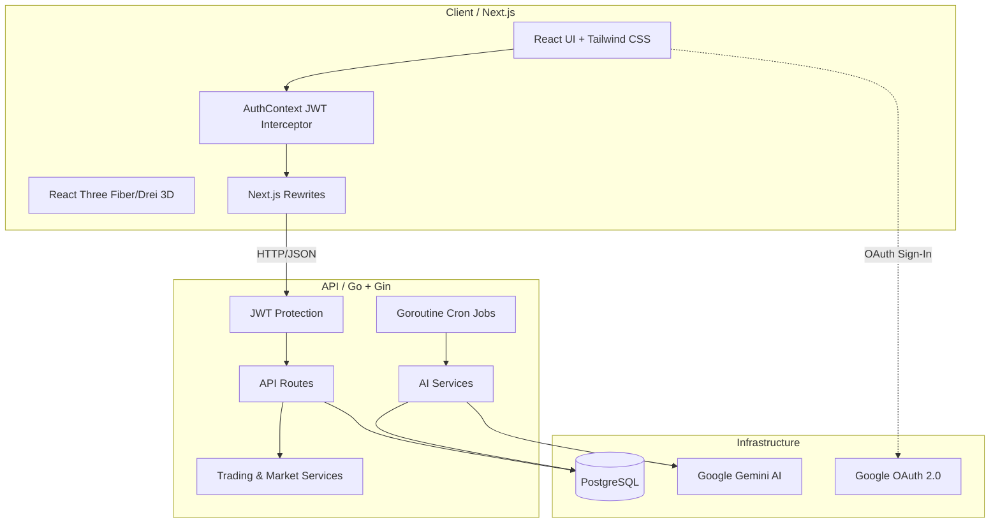
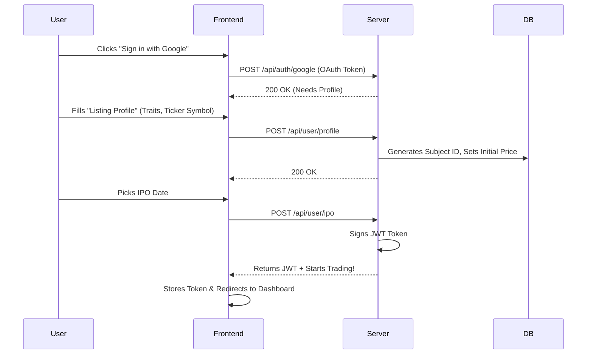
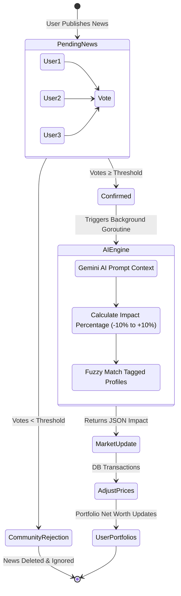
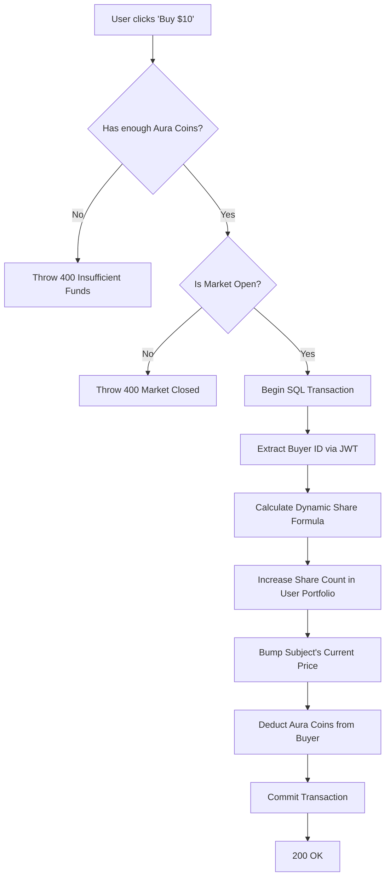

# CampusEx 📉📈
> **"Buy into your friends. Sell the fakes. Your campus, your market."**

CampusEx is a gamified, real-time social stock market platform. Users list themselves on the exchange (IPO), trade shares of their peers, place bids on events, and manipulate the market via an AI-powered news moderation engine that dynamically evaluates "campus tea" and drives stock prices upward or downward.

---

## 🏗 System Architecture

CampusEx runs on a high-octane modern web stack composed of Next.js and Go.

* **Frontend:** Next.js, Framer Motion, and Three.js elements for immersive 3D charting and interfaces. Secure `window.fetch` hooks automatically inject stateless JWTs without component clutter.
* **Backend:** Go (Gin) micro-monolith running isolated JWT-verified routes for trading, events, and shop.
* **Database:** Highly relational PostgreSQL via GORM managing dynamic user prices, aura coins, wallets, inventory, and news voting queues.

---

## 🔁 Core Data Workflows

### 1. User Onboarding & IPO Flow
When a user joins CampusEx, they do not just sign up—they "go public."

### 2. The AI "Campus Tea" Workflow 🤖
The core manipulation of the market happens through the news engine. Users post news, the community votes, and AI decides the financial impact.

### 3. Real-Time Trading Flow
Users buy and sell stakes in specific subjects (users). All math is protected by secure transaction rollbacks.

---

## 🔒 Security Posture
* **Stateless Authenticity:** We transitioned off vulnerable body payload parameters directly into a rigorous, cryptographically signed HS256 JWT infrastructure. 
* **IDOR Protection:** You cannot spoof trades, events, votes, or dating operations. IDs are strictly extrapolated out of server-side `gin.Context` wrappers.
* **CORS Proxying:** The Next.js API acts as a seamless rewrite proxy funneling traffic to Render without exposing the raw domains or facing cross-origin browser closures.

---

## 🚀 Deployment Instructions

### Backend (Render)
1. Navigate to your Render Dashboard -> "Web Service".
2. **Root Directory**: `backend`
3. **Build Command**: `go build -o server main.go`
4. **Start Command**: `./server`
5. Connect your `.env` variables (`DATABASE_URL`, `GEMINI_API_KEY`, `JWT_SECRET`). *(Port is handled locally by Render).*

### Frontend (Vercel)
1. Import repository to Vercel.
2. **Root Directory**: `frontend`
3. Add the following to Vercel Environment Variables:
   - `BACKEND_URL`: `https://campusex.onrender.com`
   - `NEXT_PUBLIC_GOOGLE_CLIENT_ID`: `<Your Client ID>`
   - `GOOGLE_CLIENT_SECRET`: `<Your Secret>`
4. Deploy. The proxy mapped inside `next.config.ts` will instantly bridge global routing.
